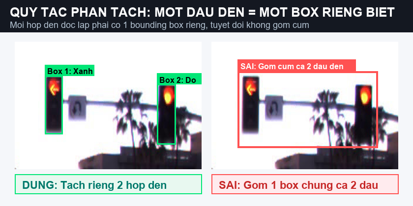

# HƯỚNG DẪN GÁN NHÃN VÀ QUY TRÌNH CVAT — TRAFFIC LIGHT STATE & RELEVANCE
**Chương trình:** VinUni AI20K — Road Elements Lab (Day 9)  
**Nhóm:** TrafficVision-AI — **Lead: ĐỖ TRUNG KIÊN**  
**Version:** v3 (Bản Đầy Đủ / Full Specification — Xem bản tóm tắt nhanh 1 trang tại: [02_guideline_quickstart.md](02_guideline_quickstart.md))  
**Phạm vi áp dụng:**
1. **Calibration Task:** [CVAT Task 26](http://localhost:8080/tasks/26) (Task Thực hành / Hiệu chỉnh nội bộ)
2. **Golden / Blind Task:** [CVAT Task 27](http://localhost:8080/tasks/27) (Task Thử thách Độc lập / Nghiệm thu)

---

## ⚡ BẢN TÓM TẮT BỎ TÚI (DÀNH CHO NGƯỜI MỚI CHƯA BIẾT GÌ — ĐỌC TRONG 60 GIÂY)

Chào bạn! Nếu bạn mới bắt đầu và chưa từng gán nhãn dữ liệu bao giờ, bạn chỉ cần ghi nhớ đúng **3 bước cực kỳ đơn giản** này:

1. **BƯỚC 1 — TÌM ĐÈN:** Nhìn xem trên cột hoặc giá treo có **hộp đèn giao thông** không?
   - ✅ **VẼ:** Chỉ vẽ khung hình chữ nhật ôm sát **cái hộp đèn** (nơi chứa các bóng đèn tròn/mũi tên).
   - ❌ **CẤM VẼ:** Không vẽ cái cột sắt dài, không vẽ đèn đường chiếu sáng vỉa hè, không vẽ đèn hậu màu đỏ ở đuôi xe ô tô, không vẽ bóng đèn in dưới vũng nước mưa!
2. **BƯỚC 2 — XEM MÀU ĐÈN (`state`):**
   - Đang sáng màu gì thì chọn màu đó: Đỏ (`red`), Vàng (`yellow`), Xanh (`green`).
   - Thấy cái hộp đèn rõ ràng nhưng không có bóng nào sáng (mất điện/tắt) → chọn `off`.
   - Đèn ở quá xa hoặc lóa mờ tịt không nhìn rõ màu gì → chọn `unknown`.
3. **BƯỚC 3 — ĐÈN NÀY DÀNH CHO AI? (`relevance`):**
   - *Tưởng tượng bạn đang ngồi ghế lái chiếc xe có gắn camera quay bức ảnh này:*
   - Đèn treo ngay phía trước làn đường xe bạn đang chạy ở ngã tư trước mặt (đèn này đỏ thì bạn phải dừng, xanh thì bạn được đi) → chọn **`ego_relevant`** (áp dụng cho xe mình).
   - Đèn có mũi tên rẽ cho làn khác, HOẶC đèn ở ngã tư tiếp theo tít đằng xa phía sau → chọn **`other_lane`** (làn khác / ngã tư khác).
   - Đèn có hình người đi bộ hoặc xe đạp → chọn **`pedestrian`**.
   - ⚠️ **LƯU Ý QUAN TRỌNG:** Schema để sẵn chữ `__undefined__` để nhắc bạn chưa chọn. Bạn **bắt buộc phải bấm chọn lại**, tuyệt đối không được để nguyên chữ `__undefined__`!

---

## MỤC LỤC CHI TIẾT
1. [Nguyên tắc Cốt lõi & Ba Cảnh Báo Sống Còn](#1-nguyên-tắc-cốt-lõi--ba-cảnh-báo-sống-còn)
2. [Giải thích Khái niệm cho Người Mới (Dễ hiểu 100%)](#2-giải-thích-khái-niệm-cho-người-mới-dễ-hiểu-100)
3. [Đơn vị Gán nhãn: Một Đầu Đèn = Một Hộp Riêng](#3-đơn-vị-gán-nhãn-một-đầu-đèn--một-hộp-riêng)
4. [Cách Vẽ Bounding Box Khít và Đẹp (Quy chuẩn Hình học)](#4-cách-vẽ-bounding-box-khít-và-đẹp-quy-chuẩn-hình-học)
5. [Ý nghĩa Chi tiết Từng Ô Thuộc tính trên CVAT](#5-ý-nghĩa-chi-tiết-từng-ô-thuộc-tính-trên-cvat)
6. [Cái gì Phải Vẽ và Cái gì Tuyệt Đối Bỏ Qua](#6-cái-gì-phải-vẽ-và-cái-gì-tuyệt-đối-bỏ-qua)
7. [Xử lý Khi Đèn Bị Che Khuất hoặc Cắt Mép](#7-xử-lý-khi-đèn-bị-che-khuất-hoặc-cắt-mép)
8. [Cây Quyết định 5 Bước (Gặp Ảnh Lạ Cứ Làm Theo Thứ Tự)](#8-cây-quyết-định-5-bước-gặp-ảnh-lạ-cứ-làm-theo-thứ-tự)
9. [Quy tắc Khi Làm Video Chuỗi Frame Liên Tiếp (Tracking)](#9-quy-tắc-khi-làm-video-chuỗi-frame-liên-tiếp-tracking)
10. [Sổ Tay 8 Bẫy Người Mới Thường Gặp & Cách Xử Lý](#10-sổ-tay-8-bẫy-người-mới-thường-gặp--cách-xử-lý)
11. [Hướng dẫn Bấm Phím Từng Bước trên Giao diện CVAT (SOP)](#11-hướng-dẫn-bấm-phím-từng-bước-trên-giao-diện-cvat-sop)
12. [Checklist 30 Giây Tự Kiểm Tra Trước Khi Nộp Bài](#12-checklist-30-giây-tự-kiểm-tra-trước-khi-nộp-bài)
13. [Quy chế Hỏi Đáp & Ghi Nhận Khi Gặp Khúc Mắc](#13-quy-chế-hỏi-đáp--ghi-nhận-khi-gặp-khúc-mắc)

---

## 1. NGUYÊN TẮC CỐT LÕI & BA CẢNH BÁO SỐNG CÒN

> [!CAUTION]
> ⚠️ **BA LỖI SAI NGUY HIỂM NHẤT CẦN TRÁNH TUYỆT ĐỐI**:
> 1. **KHÔNG BAO GIỜ GÁN NHẦM ĐÈN ĐỎ CỦA LÀN MÌNH THÀNH XANH**: Đây là lỗi nguy hiểm nhất (Critical Failure). Nếu xe tự hành bị gán nhầm đèn đỏ thành xanh, xe sẽ phi thẳng qua ngã tư và đâm vào luồng xe đối diện! Tương tự, nếu đèn đi thẳng đang đỏ mà bạn lại nhìn vào đèn rẽ xanh bên cạnh rồi gán nhầm cho xe mình thì xe cũng sẽ vượt đèn đỏ.
> 2. **CẤM GÁN `ego_relevant` CHO ĐÈN Ở NGÃ TƯ KẾ TIẾP ĐẰNG SAU**: Khi xe đang đi tới ngã tư gần, bạn nhìn xuyên qua thấy ngã tư phía sau (cách 100 - 200m) đang đỏ. Cái đèn đỏ đằng sau đó **BẮT BUỘC gán `other_lane`**! Nếu bạn gán `ego_relevant`, xe tự hành sẽ tưởng ngã tư ngay trước mặt bị cấm và phanh khựng lại bất ngờ giữa đường, làm xe phía sau đâm sầm vào đuôi xe mình!
> 3. **PHẢI CHỌN LẠI CÁC Ô CÓ CHỮ `__undefined__`**: CVAT cố ý cài giá trị mặc định là `__undefined__` để bắt buộc bạn phải suy nghĩ và click chọn giá trị đúng (`red`/`green`... và `ego_relevant`/`other_lane`...). Nếu bạn quên chọn và để nguyên `__undefined__`, hệ thống tự động chấm điểm sẽ đánh trượt bài của bạn.

---

## 2. GIẢI THÍCH KHÁI NIỆM CHO NGƯỜI MỚI (DỄ HIỂU 100%)

- **Xe tự hành (Ego Vehicle / Ego Lane) là gì?**
  - Chính là chiếc xe ô tô đang gắn camera để quay bức ảnh bạn đang nhìn thấy!
  - Làn đường xe mình (Ego Lane) là làn đường chính diện mà mũi xe đang hướng tới. Bạn hãy đóng vai người tài xế đang lái xe trên làn đó.
- **Đầu đèn tín hiệu (`signal head`) là gì?**
  - Là chiếc hộp kim loại chữ nhật (thường màu đen hoặc xám vàng) chứa các bóng đèn bên trong (ví dụ hộp 3 mắt: Đỏ - Vàng - Xanh).
  - Một cột sắt có thể gắn 1 hộp, 2 hộp hoặc 3 hộp cạnh nhau.
- **Ngã tư trước mặt (Near intersection) vs Ngã tư đằng xa (Far intersection):**
  - **Ngã tư trước mặt:** Là nơi giao nhau gần nhất mà xe bạn sắp đi qua trong vòng vài giây tới (cách 10 - 40m). Đèn ở đây trực tiếp điều khiển xe bạn (`ego_relevant`).
  - **Ngã tư đằng xa:** Là ngã tư tiếp theo, nằm tít phía sau ngã tư trước mặt (cách 100 - 200m). Đèn ở đây chưa áp dụng cho xe bạn lúc này, vì vậy BẮT BUỘC chọn `other_lane`.

---

## 3. ĐƠN VỊ GÁN NHÃN: MỘT ĐẦU ĐÈN = MỘT HỘP RIÊNG

- Mỗi **hộp đèn tín hiệu vật lý độc lập** là một hình chữ nhật riêng biệt (`rectangle`).
- **Quy tắc khi có nhiều hộp đèn trên cùng một giá treo hoặc cột sắt:**
  - Nếu trên một cột sắt có 1 hộp đèn đi thẳng và 1 hộp đèn mũi tên rẽ trái → **VẼ 2 HÌNH CHỮ NHẬT TÁCH BIỆT** cho từng hộp đèn!
  - ❌ **CẤM:** Tuyệt đối không vẽ một hình chữ nhật khổng lồ trùm lên cả cột hoặc gom chung cả 2–3 hộp đèn vào làm một.

```
       [Đèn Đi Thẳng]       [Đèn Mũi Tên Rẽ]
      +---------------+   +---------------+
      |  (Đỏ) (Vàng)  |   |  (Mũi tên đỏ) |
      |    (Xanh)     |   | (Mũi tên xanh)|
      +---------------+   +---------------+
        --> HỘP BOX 1       --> HỘP BOX 2
        (Vẽ riêng)          (Vẽ riêng)
```


*Hình 3.1: Quy tắc phân tách đầu đèn — Mỗi đầu đèn vật lý độc lập phải có một bounding box riêng, tuyệt đối không gom cụm các đầu đèn lại làm một.*

---

## 4. CÁCH VẼ BOUNDING BOX KHÍT VÀ ĐẸP (QUY CHUẨN HÌNH HỌC)

1. **Phóng to (Zoom) trước khi vẽ:** Luôn lăn chuột phóng to ảnh lên **300% đến 400%** vào đúng khu vực cái đèn. Nếu để màn hình bé tí xíu sẽ rất dễ vẽ lệch hoặc vẽ trúng cột sắt.
2. **Ôm khít mép ngoài của hộp đèn (Tight Box):**
   - 4 cạnh của hình chữ nhật phải chạm đúng vào 4 mép ngoài của vỏ hộp đèn (kể cả phần chóp che nắng nhô ra phía trên bóng đèn).
   - Không được để viền thừa quá rộng ra khoảng trời xung quanh.
   - Không được cắt lẹm vào bóng đèn bên trong.
3. **CẤM VẼ CẢ CỘT SẮT:**
   - Dừng mép hình chữ nhật ngay chỗ hộp đèn tiếp giáp với thanh đỡ kim loại. Tuyệt đối không kéo dài box để bao trùm cái cột trụ hay thanh xà ngang.
4. **Dung sai sai số cho phép:** Lệch tối đa 3 pixel mỗi cạnh. Lệch trên 5 pixel hoặc vẽ dính cột đèn sẽ bị coi là lỗi nặng.


*Hình 4.1: Quy chuẩn hình học Bounding Box — Ôm sát 4 mép ngoài vỏ hộp đèn, dừng lại ở thanh giàn sắt, không bao trùm cột kim loại.*

---

## 5. Ý NGHĨA CHI TIẾT TỪNG Ô THUỘC TÍNH TRÊN CVAT

Khi bạn bấm phím `N` và vẽ xong 1 hình chữ nhật quanh hộp đèn, bảng thuộc tính sẽ hiện ra. Bạn cần chọn đúng 4 mục sau:

| Tên thuộc tính | Bạn nhìn thấy gì thực tế? | Bạn bấm chọn giá trị nào? |
| :--- | :--- | :---: |
| **`state`**<br>*(Đèn đang bật màu gì?)* | • Bóng tròn hoặc mũi tên màu đỏ đang sáng rõ ràng.<br>• Bóng tròn hoặc mũi tên màu vàng/cam đang sáng.<br>• Bóng tròn hoặc mũi tên màu xanh lá / xanh cyan đang sáng.<br>• Ban ngày nhìn rõ hộp đèn nhưng cả 3 bóng đều tối thui (đèn tắt/mất điện).<br>• Đèn ở tít đằng xa, nhòe nhoẹt, sương mù tuyết trắng không thể đọc được màu. | `red`<br>`yellow`<br>`green`<br>`off`<br>`unknown` |
| **`relevance`**<br>*(Đèn này áp dụng cho xe mình hay ai khác?)* | • Đèn treo thẳng phía trên làn xe mình đang chạy ở ngã tư trước mặt (đèn này bảo mình đi hay dừng).<br>• Đèn có mũi tên rẽ dành cho làn rẽ bên cạnh, HOẶC đèn ở ngã tư tiếp theo phía sau cách xa 100m.<br>• Đèn có hình người đi bộ (người đỏ đứng yên, người xanh bước đi) hoặc hình xe đạp.<br>• Ngã 5 ngã 6 phức tạp, đường chéo không thể biết đèn thuộc làn nào. | `ego_relevant`<br><br>`other_lane`<br><br>`pedestrian`<br><br>`unknown` |
| **`occluded`**<br>*(Đèn có bị che khuất không?)* | • Nhìn thấy rõ toàn bộ hộp đèn, hoặc chỉ bị cọng lá nhỏ che tí xíu (< 50%).<br>• Bị cành cây to, thùng xe tải, biển báo che mất từ 50% diện tích cái đèn trở lên nhưng vẫn nhận ra đó là đèn giao thông. | `false` (bỏ tick)<br>`true` (tick chọn) |
| **`needs_review`**<br>*(Bạn có thấy phân vân nghi ngờ không?)* | • Tình huống rõ ràng, bạn tự tin 100%.<br>• Bạn thấy lóa mắt, mờ ảo, không chắc chắn màu đèn hoặc không rõ làn, cần Lead xem lại giúp. | `false` (bỏ tick)<br>`true` (tick chọn) |

- **Tag mức ảnh `image_escalate`:** Nếu cả bức ảnh bị hỏng, lóa trắng xóa toàn màn hình, hoặc mưa bão mù mịt không nhìn thấy đường sá đâu thì bấm gán tag `image_escalate` cho ảnh.

---

## 6. CÁI GÌ PHẢI VẼ VÀ CÁI GÌ TUYỆT ĐỐI BỎ QUA

### ✅ CÁC ĐỐI TƯỢNG BẮT BUỘC PHẢI VẼ (IN-SCOPE):
- Mọi hộp đèn tín hiệu giao thông nhìn thấy được trên đường (kích thước cạnh lớn nhất từ 8 pixel trở lên).
- Đèn đang sáng (đỏ, vàng, xanh) và đèn đang tắt ngóm (`state=off`).
- Đèn ở ngã tư gần và đèn ở ngã tư xa phía sau.
- Đèn tròn, đèn mũi tên, đèn người đi bộ sang đường.

### ❌ CÁC ĐỐI TƯỢNG TUYỆT ĐỐI KHÔNG ĐƯỢC VẼ (OUT-OF-SCOPE — BỎ QUA NGAY):
1. **Đèn đường chiếu sáng cao áp:** Mấy bóng đèn tròn màu vàng/cam treo lơ lửng trên cột sắt uốn cong vỉa hè dùng để rọi sáng đường ban đêm. *Không có hộp chữ nhật đèn tín hiệu → BỎ QUA!*
2. **Đèn hậu ô tô (Tail lights):** Các đốm đỏ ở đuôi xe ô tô, xe buýt chạy phía trước. *Đây là đèn của xe khác, không phải đèn giao thông → BỎ QUA!*
3. **Vệt phản chiếu trên mặt đường:** Trời mưa đường ướt thấy vệt màu đỏ rực hoặc xanh loang loáng dưới mặt đất hoặc trên kính xe. *Đây là hình ảnh phản chiếu hư ảo → BỎ QUA, chỉ vẽ cái đèn thật trên trời!*
4. **Cột sắt, biển báo tên đường, khung giàn ngang:** Chỉ vẽ hộp đèn, không vẽ bất kỳ thanh kim loại nào gắn kèm.
5. **Đèn tí hon ở quá xa (< 8 pixel):** Quá nhỏ chỉ bằng 2–3 chấm điểm ảnh li ti không nhìn ra hình thù gì → BỎ QUA.

---

## 7. XỬ LÝ KHI ĐÈN BỊ CHE KHUẤT HOẶC CẮT MÉP

1. **Bị che một phần (50% đến 80% diện tích):**
   - Ví dụ: Cành cây che mất nửa thân hộp đèn, nhưng bạn vẫn thấy bóng đèn đỏ đang sáng rực và mờ mờ viền hộp.
   - *Cách làm:* Vẽ một hình chữ nhật ước lượng toàn bộ kích thước của cả cái hộp đèn (tưởng tượng như cành cây biến mất). Gán màu đèn bình thường và **tick chọn `occluded=true`**.
2. **Bị che gần hết (> 80% diện tích):**
   - Chỉ hở ra đúng một tia sáng li ti tí xíu, hoàn toàn không thấy thân hộp đèn đâu.
   - *Cách làm:* **BỎ QUA (IGNORE)**, không vẽ vì không đủ bằng chứng chắc chắn.
3. **Đèn bị cắt ngang mép ảnh (Truncation):**
   - Đèn nằm sát rìa mép ngoài cùng của bức ảnh, bị cắt mất một phần nhưng phần còn lại vẫn nhìn thấy từ 50% trở lên.
   - *Cách làm:* Vẽ box ôm phần nhìn thấy được sát mép ảnh và tick chọn `occluded=true`.

---

## 8. CÂY QUYẾT ĐỊNH 5 BƯỚC (GẶP ẢNH LẠ CỨ LÀM THEO THỨ TỰ)

Khi bạn mở một bức ảnh đông đúc nhiều luồng xe cộ, hãy bình tĩnh làm theo đúng **5 bước tuần tự** này:

- **Bước 1:** Có nhìn thấy rõ cấu trúc hộp đèn không?
  - Không (chỉ là đốm sáng mờ ảo hoặc đèn đường) → **DỪNG LẠI, KHÔNG VẼ**.
  - Có (thấy rõ hộp đèn tín hiệu >= 8 px) → Đi tiếp sang Bước 2.
- **Bước 2:** Đèn gắn ở vị trí nào?
  - Treo trên giá long môn ngay chính giữa làn xe mình đang chạy → Chuẩn bị gán `ego_relevant`.
  - Treo lệch sang cột bên phải/trái có kèm biển phụ rẽ hoặc mũi tên → Chuẩn bị gán `other_lane`.
  - Có hình người đi bộ / xe đạp → Gán `relevance=pedestrian`.
- **Bước 3:** Xe mình đang đi thẳng hay rẽ?
  - Xe mình đang chạy làn thẳng thì chỉ quan tâm đèn đi thẳng. Mọi đèn mũi tên rẽ trái/phải bên cạnh đều là `other_lane`.
- **Bước 4:** Đèn này thuộc ngã tư trước mặt hay ngã tư tiếp theo phía xa?
  - Ngã tư trước mặt → Gán `ego_relevant`.
  - Ngã tư kế tiếp tít đằng sau → BẮT BUỘC gán `other_lane`.
- **Bước 5 (Khi không chắc chắn):**
  - Nếu gặp ngã 5 ngã 6, giao lộ xiên vẹo hoặc ánh sáng quá chói lóa không biết màu gì → Gán `state=unknown`, `relevance=unknown` và **tick chọn `needs_review=true`** để Lead kiểm tra lại.

---

## 9. QUY TẮC KHI LÀM VIDEO CHUỖI FRAME LIÊN TIẾP (TRACKING)

Khi gán nhãn đoạn clip ngắn có nhiều khung hình chuyển động liên tiếp:

1. **Cùng một cái đèn phải giữ nguyên một Track ID:** Khi dùng công cụ **Track**, từ frame đầu tiên đến frame cuối cùng, cái đèn đó phải mang cùng một số ID định danh (không được xóa đi vẽ lại tạo ID mới).
2. **Thuộc tính `relevance` không được đổi thất thường:** Nếu frame trước cái đèn đó là `ego_relevant`, thì các frame sau khi xe tiến lại gần nó vẫn phải là `ego_relevant` (không thể tự nhiên frame sau biến thành `other_lane`).
3. **Màu đèn (`state`) đổi theo chu trình thực tế:**
   - Đèn đổi màu bình thường: Xanh → Vàng → Đỏ, hoặc Đỏ → Xanh.
   - Nếu bạn thấy vừa frame trước xanh, frame ngay sau nhảy thẳng sang đỏ trong 0.1 giây là có dấu hiệu bất thường, cần tua lại kiểm tra kỹ bóng vàng ở giữa.
4. **Bị xe tải che mất trong vài frame:** Nếu có xe tải đi qua che khuất mất cái đèn trong 2–3 frame, đừng đoán mò màu đèn khi hoàn toàn không nhìn thấy ánh sáng; hãy ẩn track hoặc đặt `state=unknown`.

---

## 10. SỔ TAY 8 BẪY NGƯỜI MỚI THƯỜNG GẶP & CÁCH XỬ LÝ

| # | Tình huống thực tế trên ảnh | Bạn sẽ nhìn thấy hiện tượng gì? | Cách xử lý chuẩn xác 100% |
|:---:|:---|:---|:---|
| **1** | **Cột có 2 hộp đèn cạnh nhau** | Cột có 1 hộp đèn tròn đỏ và 1 hộp đèn mũi tên xanh rẽ phải | • **Vẽ 2 hình chữ nhật riêng biệt** cho 2 hộp đèn.<br>• Hộp tròn đỏ: `state=red`, `relevance=ego_relevant` (xe mình đi thẳng).<br>• Hộp mũi tên xanh: `state=green`, `relevance=other_lane` (cho làn rẽ). |
| **2** | **Đèn ban đêm không thấy vỏ hộp đen (Chỉ thấy đốm sáng)** | Ban đêm trời tối thui, chỉ thấy đốm sáng xanh ngọc phát sáng lơ lửng, không thấy viền hộp đen đâu | • Áp dụng **Quy tắc bóng đèn sáng (Visible Lamp Rule)**.<br>• **Vẽ một hình chữ nhật nhỏ ôm chặt lấy cái lõi bóng đèn tròn đang sáng** (kích thước khoảng 8x8 đến 10x10 px).<br>• **Không vẽ lan ra quầng sáng chói lóa xung quanh** và không đoán mò vẽ một cái hộp to đùng.<br>• Chọn `state=green` (hoặc `red`), `relevance=ego_relevant`, tick `occluded=true` (do vỏ hộp bị chìm trong bóng tối ban đêm).<br>• Nếu phát hiện đầu đèn người đi bộ trên vỉa hè (như bóng đỏ người đi bộ), vẽ box riêng và chọn `relevance=pedestrian`, `occluded=false`. |
| **3** | **Đèn đường chiếu sáng cao áp** | Đốm sáng tròn màu vàng/cam trên cột sắt uốn cong vỉa hè | • **BỎ QUA (IGNORE — Tuyệt đối không vẽ box)**.<br>• Chỉ vẽ khi nhìn thấy cấu trúc hộp đèn tín hiệu giao thông. Đèn đường đơn lẻ phải bỏ qua. |
| **4** | **Đèn hậu ô tô màu đỏ phía trước** | Mấy đốm sáng đỏ ở tầm thấp ngang đuôi các xe hơi | • **BỎ QUA (IGNORE — Tuyệt đối không vẽ box)**.<br>• Đây là đèn đuôi xe khác, không phải đèn giao thông. |
| **5** | **Ngã tư ban đêm & Hai ngã tư liên tiếp (Gần vs Xa)** | Ngã tư gần có đèn đi thẳng xanh và đèn người đi bộ đỏ; phía xa dọc tuyến đường có thêm các đầu đèn nhỏ mờ | • **Đèn ngã tư gần:** Box đi thẳng: `state=green`, `relevance=ego_relevant`; Box người đi bộ: `state=red`, `relevance=pedestrian`.<br>• **Các đầu đèn nhỏ ở ngã tư xa:** Vẽ box ôm đầu đèn, chọn màu quan sát được (`red`/`green`), và **BẮT BUỘC tick `needs_review=true`**.<br>• *Lưu ý sống còn:* Không bao giờ để đèn đỏ ngã tư xa làm xe phanh gấp khi ngã tư trước đang xanh! |
| **6** | **Trời mưa mặt đường ướt phản chiếu** | Vệt sáng màu đỏ rực hoặc xanh in loang loáng dưới mặt đường nhựa ướt | • **BỎ QUA vệt phản chiếu dưới đất**.<br>• Chỉ vẽ duy nhất cái hộp đèn thật treo trên cột cao. |
| **7** | **Đèn bị tắt ngóm (Mất điện / Tắt đèn)** | Ban ngày nhìn rõ cái hộp đèn nhưng cả 3 bóng đều tối om | • **VẪN PHẢI VẼ BOX** ôm khít hộp đèn.<br>• Gán `state=off`.<br>• `relevance=ego_relevant` (nếu nằm trên làn xe mình). Giúp xe tự hành biết ngã tư mất điện để giảm tốc độ. |
| **8** | **Đèn ở ngã tư xa kích thước nhỏ** | Đèn ở xa có kích thước nhỏ từ 8 px đến 15 px, mờ nhòe | • Kích thước dưới 8 px: **BỎ QUA**.<br>• Từ 8 px đến 15 px: Vẽ box ôm đầu đèn, nếu mờ không chắc màu thì gán `state=unknown`, `relevance=unknown`, tick `needs_review=true`. |

---

## 11. HƯỚNG DẪN BẤM PHÍM TỪNG BƯỚC TRÊN GIAO DIỆN CVAT (SOP)

Nếu đây là lần đầu tiên bạn ngồi vào máy tính mở CVAT:

1. **Mở Job được giao:**
   - Nhấp vào link Job (ví dụ [Job #20](http://localhost:8080/tasks/26/jobs/20) hoặc [Job #21](http://localhost:8080/tasks/27/jobs/21)).
   - Đăng nhập tài khoản của bạn.
2. **Lăn chuột phóng to (Zoom):**
   - Đặt con trỏ chuột vào vùng giao lộ có đèn, lăn con lăn chuột về phía trước để phóng to 300% - 400%.
   - Nhấn giữ chuột giữa (hoặc phím cách `Space` + chuột trái) để kéo rê bức ảnh tới vị trí thuận tiện.
3. **Bấm phím `N` để vẽ:**
   - Nhấn phím **`N`** trên bàn phím.
   - Nhấp chuột trái vào **góc trên-bên trái** của hộp đèn.
   - Di chuyển chuột chéo xuống **góc dưới-bên phải** của hộp đèn rồi nhấp chuột trái lần thứ 2. Một khung hình chữ nhật màu sắc sẽ xuất hiện ôm lấy cái đèn.
4. **Chọn thuộc tính bên thanh điều khiển phải:**
   - Ô **`state`**: Bấm vào chọn đúng màu (`red`, `yellow`, `green`, `off`, `unknown`).
   - Ô **`relevance`**: Bấm vào chọn đối tượng áp dụng (`ego_relevant`, `other_lane`, `pedestrian`, `unknown`).
   - Ô **`occluded`**: Nếu đèn bị cành cây/xe tải che trên 50% thì tick vào ô này.
   - Ô **`needs_review`**: Nếu thấy phân vân nghi vấn thì tick vào ô này.
5. **Lưu bài và chuyển ảnh:**
   - Bấm tổ hợp phím **`Ctrl + S`** (trên máy tính sẽ hiện thông báo nhỏ đã lưu thành công).
   - Bấm phím **`F`** (hoặc phím mũi tên sang phải) để chuyển sang bức ảnh tiếp theo.

---

## 12. CHECKLIST 30 GIÂY TỰ KIỂM TRA TRƯỚC KHI NỘP BÀI

Trước khi báo cáo với Lead là bạn đã gán nhãn xong, hãy dành đúng 30 giây tự hỏi mình 4 câu hỏi này:

- [ ] **1. Đã chọn hết các ô chưa?** Mở danh sách Objects bên phải, kiểm tra xem có ô nào còn dính chữ mặc định `__undefined__` không? (Nếu còn, phải sửa lại ngay!).
- [ ] **2. Có lỡ tay vẽ cả cái cột sắt không?** Kiểm tra lại các box xem có box nào kéo dài ngoằng bao trùm cả cột kim loại hay giá treo không? (Nếu có, kéo ngắn box lại chỉ ôm cái hộp đèn).
- [ ] **3. Có vẽ nhầm đèn đường hay đèn đuôi xe ô tô không?** Ban đêm nhìn kỹ: chỉ vẽ đèn tín hiệu giao thông, không vẽ đèn cao áp vỉa hè hay đèn phanh ô tô.
- [ ] **4. Đèn ở ngã tư phía xa đã chọn `other_lane` chưa?** Nếu nhìn thấy đèn ở ngã tư sau, chắc chắn 100% rằng bạn đã chọn `relevance=other_lane` chứ không chọn `ego_relevant`.

---

## 13. QUY CHẾ HỎI ĐÁP & GHI NHẬN KHI GẶP KHÚC MẮC

1. **Khi bạn gặp một bức ảnh quá khó:**
   - Đừng tự ý đoán mò rồi vẽ bừa.
   - Hãy chọn `state=unknown`, `relevance=unknown` và **tick chọn `needs_review=true`**.
2. **Ghi nhận thắc mắc vào sổ:**
   - Trong quá trình làm, mọi câu hỏi thắc mắc của bạn hoặc nhóm bạn chéo sẽ được ghi vào file [clarification_log.csv](07_blind_handoff/clarification_log.csv).
   - Những giải đáp của Lead sẽ được đúc kết và cập nhật vào [08_revision_log.md](08_revision_log.md) để những người làm sau không bao giờ bị vướng mắc nữa!

---
*Chúc bạn có một buổi làm việc gán nhãn thật vui, chính xác và hiệu quả cùng nhóm TrafficVision-AI!*
