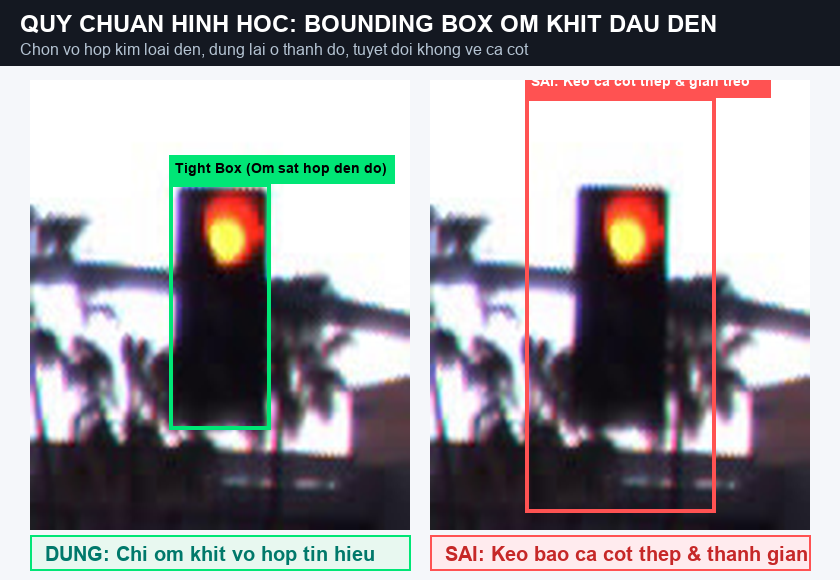
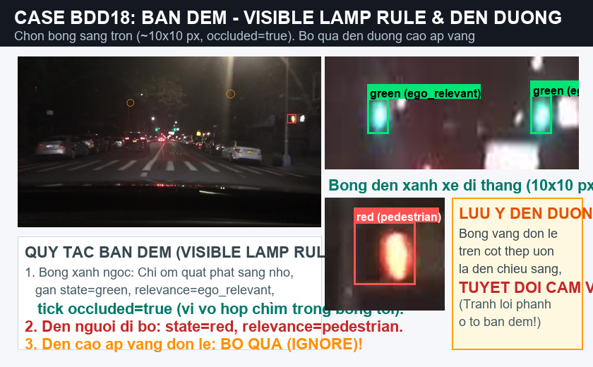

# TÓM TẮT QUY TRÌNH GÁN NHÃN ĐÈN GIAO THÔNG (BẢN RÚT GỌN / CHEATSHEET)
**Chương trình:** VinUni AI20K — Road Elements Lab (Day 9)  
**Nhóm:** TrafficVision-AI — **Lead: ĐỖ TRUNG KIÊN**  
**Version:** v3 (Bản tóm tắt 1 trang — Dành cho người cần thao tác nhanh / Người lười đọc)  
*(Bản đầy đủ 13 mục xem tại: [02_guideline.md](02_guideline.md))*

---

## ⚡ 1. QUY TRÌNH 3 BƯỚC THẦN TỐC (ĐỌC TRONG 60 GIÂY)

1. **BƯỚC 1 — TÌM HỘP ĐÈN:**
   - ✅ **Chỉ vẽ duy nhất chiếc hộp kim loại chữ nhật** chứa các bóng đèn tín hiệu.
   - ❌ **Tuyệt đối không vẽ cái cột sắt** hay thanh xà ngang giàn treo gantry.
2. **BƯỚC 2 — CHỌN MÀU ĐÈN (`state`):**
   - Đang sáng màu gì chọn màu đó: Đỏ (`red`), Vàng (`yellow`), Xanh (`green`).
   - Hộp đèn tắt ngóm không bóng nào sáng (mất điện/tắt) $\rightarrow$ chọn `off`.
   - Đèn ở quá xa, mờ tịt, lóa sáng không phân biệt được màu $\rightarrow$ chọn `unknown`.
3. **BƯỚC 3 — CHỌN ĐỐI TƯỢNG ÁP DỤNG (`relevance`):**
   - Tưởng tượng bạn đang ngồi ghế lái chiếc xe gắn camera:
   - Đèn của làn xe mình đi thẳng ở ngã tư trước mặt $\rightarrow$ chọn **`ego_relevant`**.
   - Đèn rẽ trái/phải cho làn khác, HOẶC đèn ở ngã tư tiếp theo phía sau $\rightarrow$ chọn **`other_lane`**.
   - Đèn có hình người đi bộ (bàn tay đỏ, người xanh) hoặc xe đạp $\rightarrow$ chọn **`pedestrian`**.
   - ⚠️ **LƯU Ý:** Bắt buộc bấm chọn lại các ô có chữ `__undefined__`, không được để nguyên!

---

## 📊 2. BẢNG TRA CỨU NHANH: "THẤY GÌ $\rightarrow$ BẤM GÌ"

| Bạn nhìn thấy tình huống gì trên ảnh? | Thuộc tính bạn bấm chọn trên CVAT |
| :--- | :--- |
| **Đèn đi thẳng trước mặt đang bật đỏ/vàng/xanh** | • `state`: chọn `red` / `yellow` / `green` • `relevance`: `ego_relevant` |
| **Đèn có mũi tên rẽ trái / rẽ phải** | • `relevance`: **`other_lane`** *(dành cho làn rẽ, không phải làn đi thẳng)* |
| **Đèn ở ngã tư tiếp theo phía sau (cách 100 - 200m)** | • `relevance`: **`other_lane`** *(BẮT BUỘC, tránh lỗi xe phanh gấp giữa đường)* |
| **Đèn có hình người đi bộ (bàn tay đỏ / người xanh)** | • `relevance`: **`pedestrian`** |
| **Ban ngày nhìn rõ hộp đèn nhưng tối om (mất điện/tắt)** | • `state`: **`off`** |
| **Đèn ở ngã tư xa mờ tịt, sương mù, không rõ màu** | • `state`: **`unknown`**, `relevance`: `other_lane` hoặc `unknown` • **Tick chọn `needs_review=true`** |
| **Đèn bị cành cây/thùng xe tải che mất hơn 50% thân đèn** | • Vẽ box ước lượng cả hộp đèn • **Tick chọn `occluded=true`** |
| **Ban đêm nền trời tối thui, chỉ thấy đốm xanh ngọc lơ lửng** | • Vẽ box nhỏ ôm khít đốm sáng tròn phát sáng (8x8 đến 10x10 px) • `state`: `green` (hoặc `red`), `relevance`: `ego_relevant`, tick `occluded=true` • Nếu thấy đèn người đi bộ đỏ trên vỉa hè → gán `relevance=pedestrian` |

---

## 🚫 3. NĂM ĐIỀU TUYỆT ĐỐI CẤM (VẼ SAI LÀ BỊ ĐÁNH TRƯỢT)

1. ❌ **CẤM vẽ cả cái cột sắt hoặc thanh gantry:** Chỉ vẽ chiếc hộp đèn, chạm tới thanh sắt là dừng lại.
2. ❌ **CẤM vẽ đèn đường cao áp chiếu sáng vỉa hè:** Mấy bóng đèn vàng cam đơn lẻ trên cột uốn lượn để rọi sáng đường ban đêm $\rightarrow$ BỎ QUA NGAY.
3. ❌ **CẤM vẽ đèn hậu ô tô (Tail lights):** Mấy đốm đỏ ở đuôi xe ô tô chạy phía trước $\rightarrow$ BỎ QUA.
4. ❌ **CẤM vẽ vệt phản chiếu dưới mặt đường:** Trời mưa đường ướt thấy vệt màu đỏ/xanh in loang loáng dưới đất $\rightarrow$ BỎ QUA, chỉ vẽ hộp đèn thật trên cao.
5. ❌ **CẤM vẽ gom cụm đèn:** Trên 1 cột có 2–3 hộp đèn cạnh nhau $\rightarrow$ BẮT BUỘC vẽ các hình chữ nhật riêng biệt cho từng hộp đèn!

*Hình minh họa: Ôm sát vỏ hộp đèn tín hiệu, không vẽ cột sắt.*

*Hình minh họa ban đêm: Áp dụng Visible Lamp Rule và bỏ qua đèn đường cao áp vàng.*

---

## ⌨️ 4. THAO TÁC 3 BƯỚC TRÊN CVAT

- **Lăn chuột:** Phóng to (Zoom) **300% – 400%** vào vị trí đèn.
- **Phím `N`:** Click góc trên-trái kéo sang góc dưới-phải để vẽ hộp đèn.
- **Phím `Ctrl + S`:** Lưu bài sau mỗi ảnh.
- **Phím `F`:** Chuyển sang ảnh tiếp theo.
